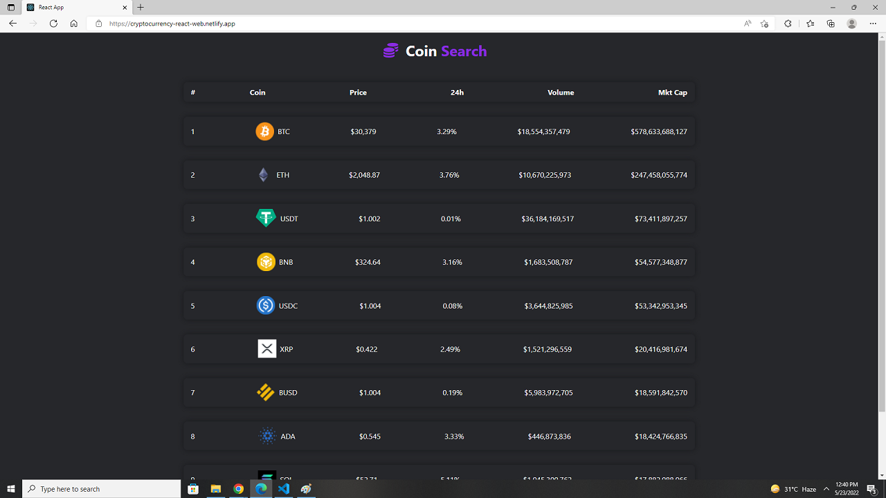

# CryptoCurrency App with React JS using API
    
  

### Live Link - https://cryptocurrency-react-web.netlify.app/

I used React, React Router, Axios, Api to build the project  .
 

### Api Link

TrendingCoin: https://api.coingecko.com/api/v3/coins/markets?vs_currency=usd

CoinDetails:  https://api.coingecko.com/api/v3/coins/${params.coinId}

### Author Links  

👋 Hello,I am Shadman and I am a Full Stack Web developer  

🚀 Follow me:  

  - [Github](https://github.com/sakibshadman19)
  - [LinkedIn](https://www.linkedin.com/in/shadmansakib1/)
  - [Facebook](https://www.facebook.com/shadman.sakibtanmoy)
  

<!-- all link is here -->

